# Architecture Documentation

> AdsPower Bot Engine - Technical Architecture & Design

## Table of Contents

1. [System Overview](#system-overview)
2. [High-Level Architecture](#high-level-architecture)
3. [Component Details](#component-details)
4. [Data Flow](#data-flow)
5. [Module Structure](#module-structure)
6. [Database Schema](#database-schema)
7. [API Architecture](#api-architecture)
8. [Security Architecture](#security-architecture)
9. [Deployment Architecture](#deployment-architecture)

---

## System Overview

The AdsPower Bot Engine is a modular automation framework designed for browser automation with anti-detection capabilities. It integrates multiple external services while maintaining a clean separation of concerns.

### Core Principles

- **Modularity**: Each component is self-contained and replaceable
- **Observability**: Real-time monitoring via WebSocket and REST API
- **Resilience**: Automatic proxy rotation and failure recovery
- **Human-like**: Sophisticated behavior simulation to avoid detection

---

## High-Level Architecture

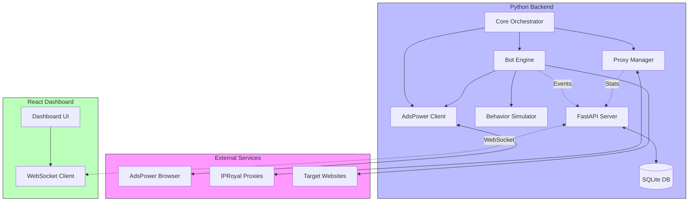

---

## Component Details

### 1. Core Layer (`src/core/`)

The orchestration layer that coordinates all bot activities.

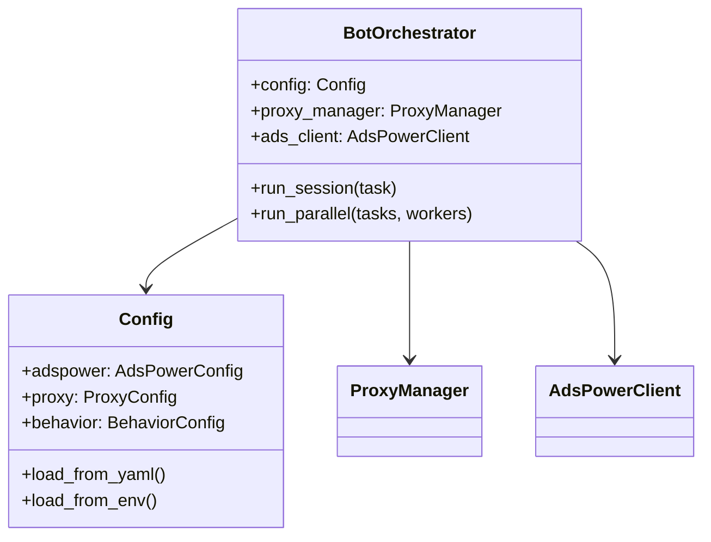

**Key Files:**
- `config.py` - Configuration management (YAML + environment variables)
- `orchestrator.py` - Session orchestration and parallel execution

### 2. AdsPower Integration (`src/adspower/`)

Manages browser profiles and Playwright connections.

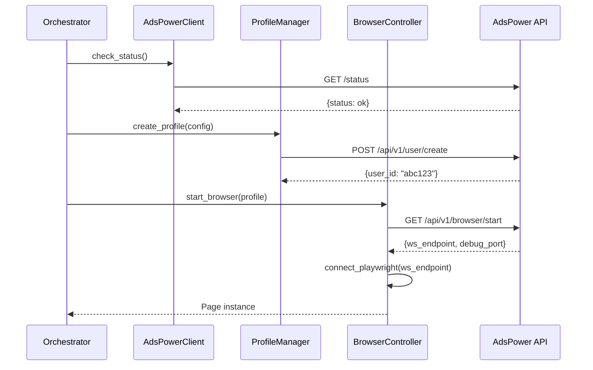

**Key Files:**
- `client.py` - HTTP client for AdsPower API
- `profile.py` - Profile data models
- `controller.py` - Browser lifecycle management
- `browser.py` - Playwright connection handling

### 3. Proxy Management (`src/proxy/`)

Handles proxy rotation, health tracking, and session management.

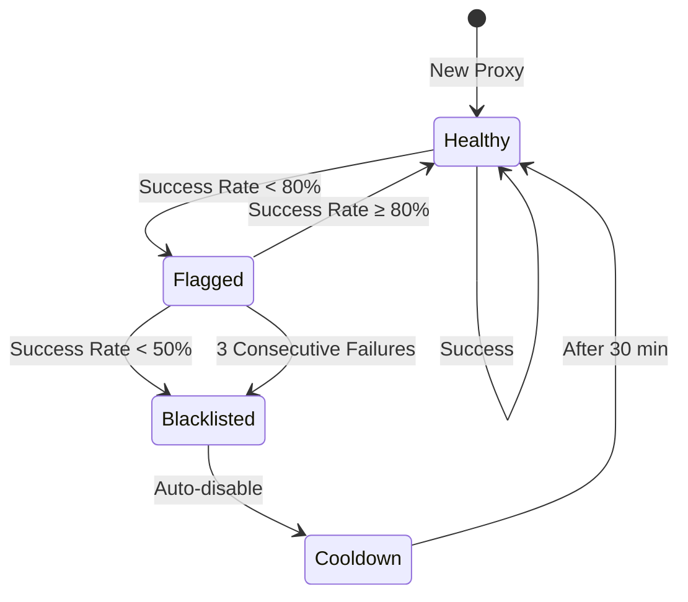

**Key Files:**
- `iproyal.py` - IPRoyal proxy configuration
- `rotation.py` - Rotation strategies (round-robin, weighted, random)
- `stats.py` - Proxy statistics and health scoring
- `session_manager.py` - Sticky session management

### 4. Bot Engine (`src/bot/`)

Executes bot actions with human-like behavior.

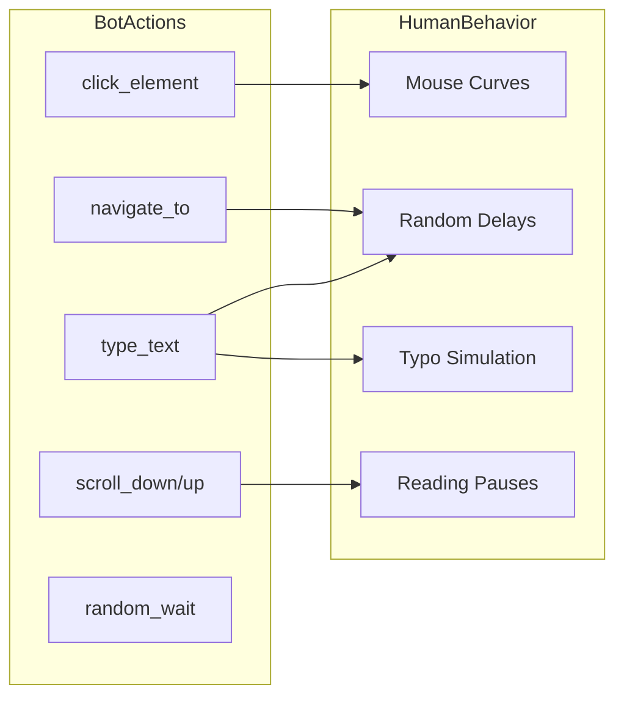

**Key Files:**
- `actions.py` - High-level bot actions (navigate, click, type, scroll)
- `human_behavior.py` - Human-like behavior patterns
- `session.py` - Bot session lifecycle

### 5. Behavior Simulation (`src/behavior/`)

Low-level human behavior simulation algorithms.

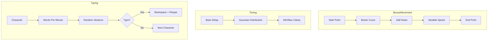

**Key Files:**
- `mouse.py` - Bezier curve mouse movements
- `timing.py` - Gaussian-distributed delays
- `scroll.py` - Natural scrolling patterns
- `interaction.py` - Click and hover behaviors
- `focus.py` - Tab focus simulation

### 6. API Layer (`src/api/`)

FastAPI backend with WebSocket support.

```mermaid
flowchart TB
    subgraph Endpoints
        HEALTH[/api/health]
        SESSIONS[/api/sessions]
        STATS[/api/stats]
        EVENTS[/api/events]
        IP[/api/ip/status]
        EXPORT[/api/*/export]
    end

    subgraph Middleware
        AUTH[API Key Auth]
        CORS[CORS]
        RATE[Rate Limiting]
    end

    subgraph Realtime
        WS[WebSocket /ws]
        BROADCAST[Event Broadcast]
    end

    CLIENT --> AUTH
    AUTH --> CORS
    CORS --> RATE
    RATE --> Endpoints
    
    BOT -.->|Events| BROADCAST
    BROADCAST --> WS
    WS --> DASHBOARD
```

**Key Files:**
- `server.py` - FastAPI application and endpoints
- `session_tracker.py` - Session tracking (HTTP or local)
- `database_logger.py` - SQLite persistence
- `event_logger.py` - File-based logging

---

## Data Flow

### Session Lifecycle

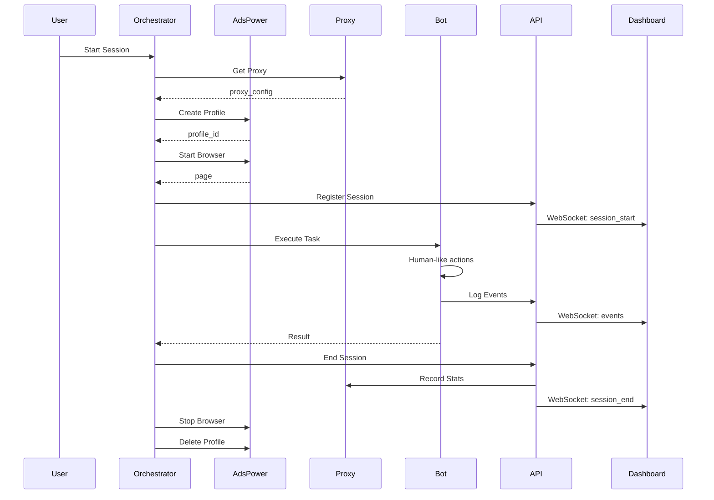

### Event Flow

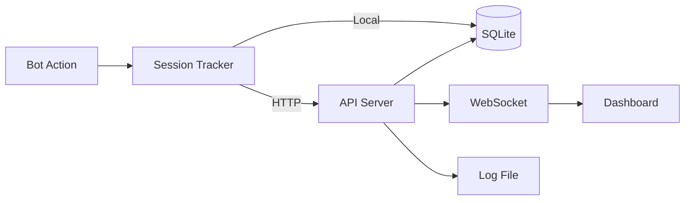

---

## Module Structure

```
src/
├── __init__.py
├── adspower/                 # AdsPower Integration
│   ├── __init__.py          # Exports: AdsPowerClient, ProfileManager, BrowserController
│   ├── client.py            # HTTP client for AdsPower API
│   ├── profile.py           # Profile data models
│   ├── profile_factory.py   # Profile creation helpers
│   ├── controller.py        # Browser lifecycle management
│   └── browser.py           # Playwright connection
│
├── api/                      # FastAPI Backend
│   ├── __init__.py          # Exports: get_tracker
│   ├── server.py            # FastAPI app, endpoints, WebSocket
│   ├── session_tracker.py   # HTTP/Local session tracking
│   ├── database_logger.py   # SQLite persistence
│   └── event_logger.py      # File logging
│
├── behavior/                 # Human Behavior Algorithms
│   ├── __init__.py
│   ├── mouse.py             # Bezier curve movements
│   ├── timing.py            # Gaussian delays
│   ├── scroll.py            # Natural scrolling
│   ├── interaction.py       # Click/hover patterns
│   └── focus.py             # Tab focus simulation
│
├── bot/                      # Bot Engine
│   ├── __init__.py          # Exports: BotActions, HumanBehavior
│   ├── actions.py           # High-level actions
│   ├── human_behavior.py    # Behavior orchestration
│   └── session.py           # Session management
│
├── core/                     # Core Orchestration
│   ├── __init__.py          # Exports: load_config, BotOrchestrator
│   ├── config.py            # Configuration (YAML + env)
│   └── orchestrator.py      # Session orchestration
│
├── proxy/                    # Proxy Management
│   ├── __init__.py          # Exports: IPRoyalProxy, ProxyManager
│   ├── iproyal.py           # IPRoyal configuration
│   ├── rotation.py          # Rotation strategies
│   ├── stats.py             # Health tracking
│   └── session_manager.py   # Sticky sessions
│
├── reputation/               # Proxy Reputation System
│   ├── cooldown.py          # Cooldown management
│   ├── policy.py            # Scoring policies
│   ├── scorer.py            # Health scoring
│   └── store.py             # Persistence
│
├── events/                   # Event System
│   ├── __init__.py
│   ├── types.py             # Event type definitions
│   ├── logger.py            # Event logging
│   └── store.py             # Event storage
│
└── session/                  # Session Management
    ├── context.py           # Session context
    ├── logger.py            # Session logging
    ├── orchestrator.py      # Multi-session orchestration
    └── runner.py            # Session execution
```

---

## Database Schema

### SQLite Tables

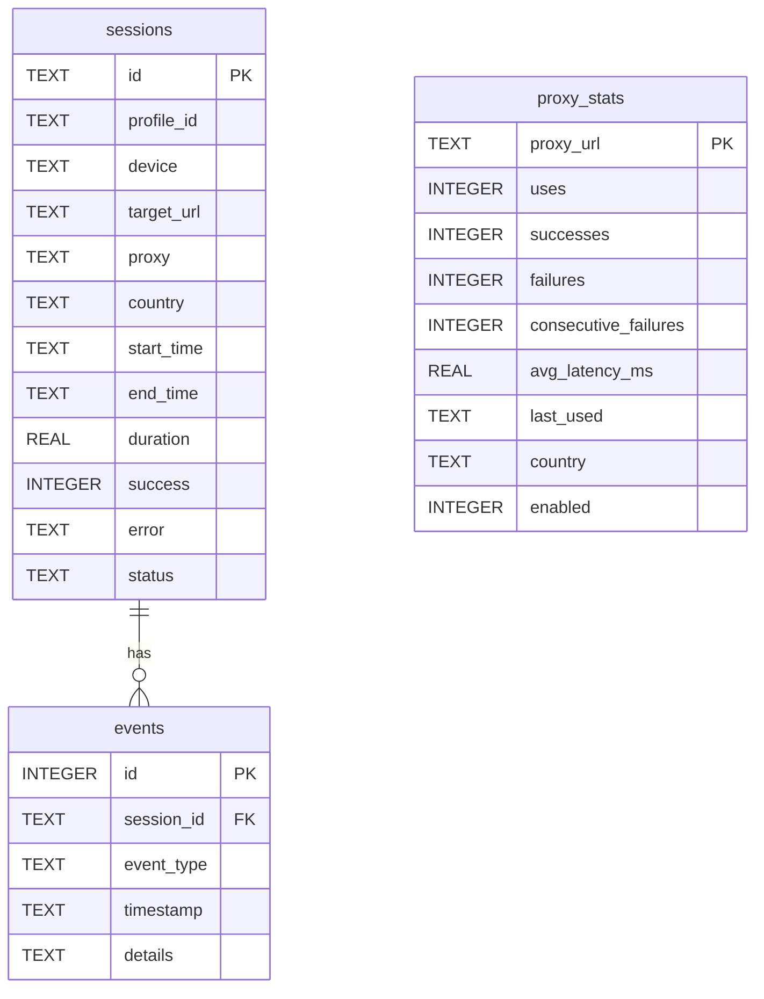

---

## API Architecture

### Endpoint Summary

| Endpoint | Method | Auth | Rate Limit | Description |
|----------|--------|------|------------|-------------|
| `/api/health` | GET | No | No | Health check |
| `/api/sessions` | GET | Yes | Yes | List sessions (paginated) |
| `/api/sessions/{id}` | GET | Yes | Yes | Session details |
| `/api/sessions/register` | POST | Yes | Yes | Register new session |
| `/api/sessions/end` | POST | Yes | Yes | End session |
| `/api/sessions/export` | GET | Yes | Yes | Export to CSV |
| `/api/stats` | GET | Yes | Yes | Statistics |
| `/api/events` | GET | Yes | Yes | List events (paginated) |
| `/api/events` | POST | Yes | Yes | Log event |
| `/api/events/export` | GET | Yes | Yes | Export to CSV |
| `/api/ip/status` | GET | Yes | Yes | Proxy health |
| `/ws` | WS | No | No | Real-time updates |

### WebSocket Events

```typescript
// Session events
{ type: "session_start", data: { session_id, profile_id, proxy, country } }
{ type: "session_end", data: { session_id, success, duration, error } }

// Bot events
{ type: "event", data: { session_id, event_type, details, timestamp } }

// Stats updates
{ type: "stats_update", data: { total_sessions, active_sessions, ... } }
```

---

## Security Architecture

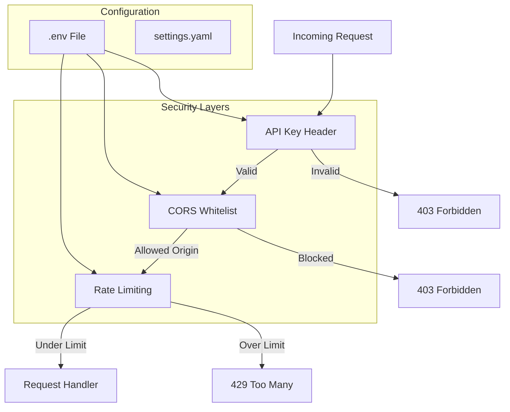

### Security Configuration

```env
# .env
API_KEY=your_secret_key_here
ALLOWED_ORIGINS=http://localhost:3000,https://yourdomain.com
RATE_LIMIT=100/minute
```

---

## Deployment Architecture

### VPS Deployment

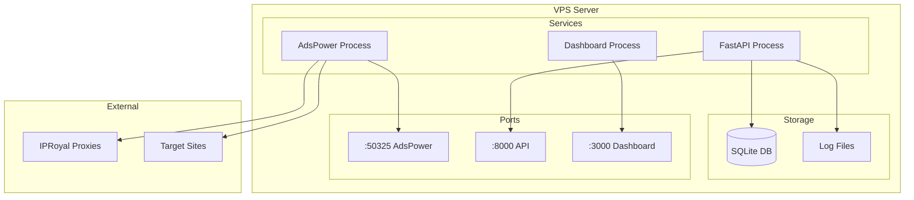

### Startup Sequence

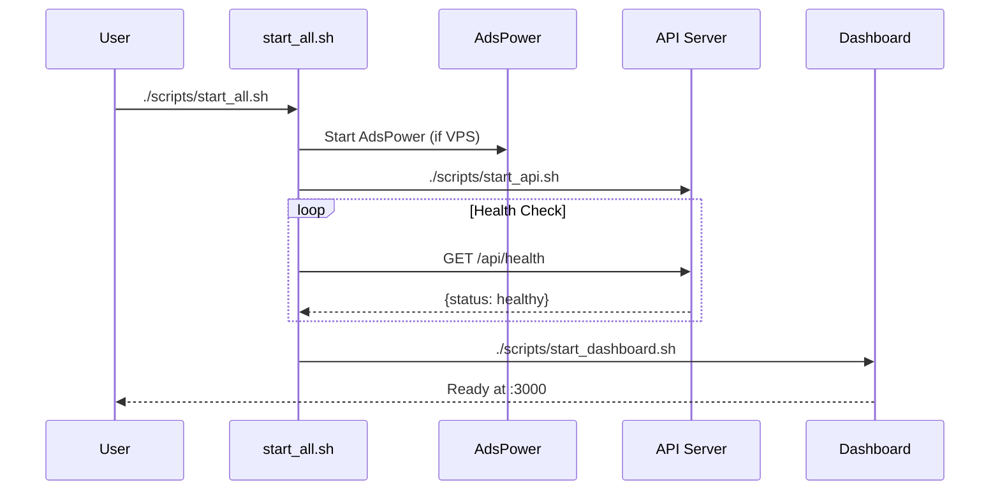

---

## Related Documentation

- [README.md](../README.md) - Quick start guide
- [DEVELOPMENT.md](./DEVELOPMENT.md) - Development guide & extending the system
- [API.md](./API.md) - Full API reference

---

*Last updated: January 2026*
